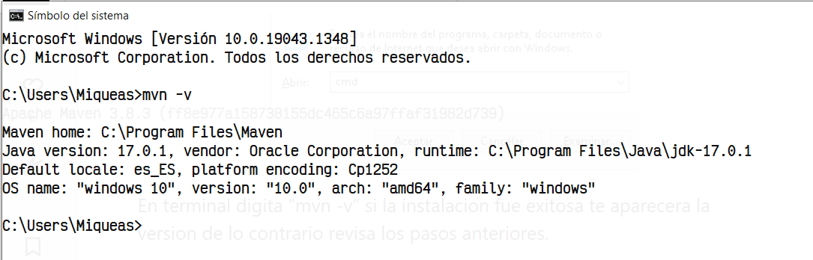
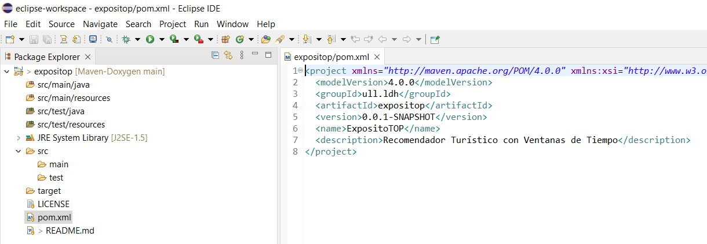
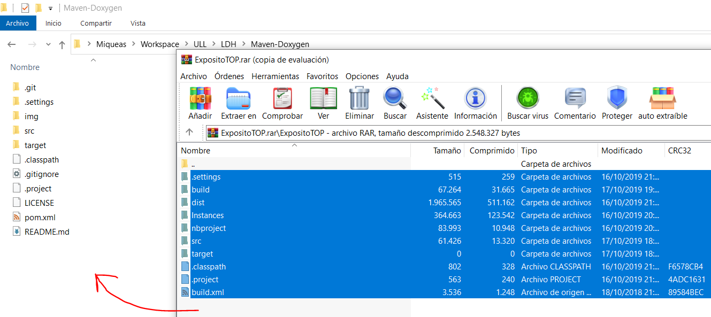
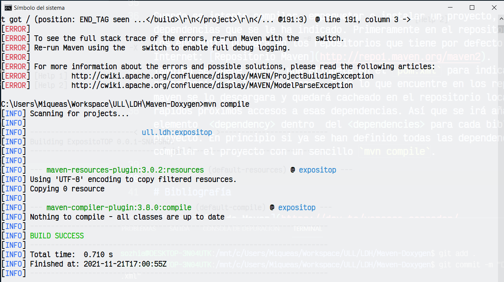
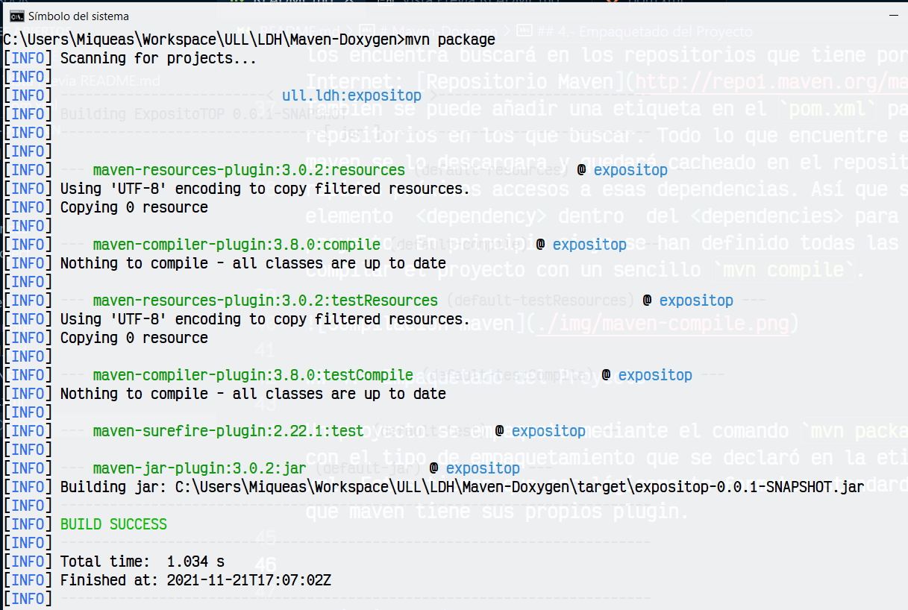

# Maven-Doxygen
Herramientas de Calidad del Producto Software y Documentación. SonarQube, Maven y Doxygen

## 0.- Instalación manual de Maven
#### Antes de comenzar

Antes de instalar Maven se requiere que previamente tener instalado JDK y tenerlo añadido en las variables de entorno. 

### Descargar Maven

El enlace para descargar Maven es el siguiente http://maven.apache.org/download.cgi#Installation en el apartado files aparecen los enlaces de de descarga elige el comprensor que prefieras.

### Instalar Maven

Primero se debe descomprimir el archivo y se recomienda copiar la carpeta en el directorio `C:\Program Files` o donde el usuario prefiera.
Ahora, se debe añadir a las variables de entorno el directorio `Maven\bin`. Se procede a comprobar la versión actual de `Maven` con el comando `mvn -v`.

## 1.-Construcción del proyecto en Eclipse

El proyecto descargado ha de ser integrado en nuestro IDE, para ello, y para evitar ciertos errores de compilación, se creará un nuevo `Maven simple project` en Eclipse que contendrá la estructura básica del futuro proyecto.

Como se puede apreciar, el `pom.xml` no es el final, sino el básico deseado para modificar.

## 2.-Volcado del proyecto

Volcamos el contenido descargado en la carpeta del proyecto creada por Eclipse.

## 3.- Dependencias

Cuando se intenta compilar, empaquetar o instalar un proyecto, `maven` buscará las dependencias que se le ha indicado. Primeramente en el repositorio local y si no los encuentra buscará en los repositorios que tiene por defecto configurados vía Internet: [Repositorio Maven](http://repo1.maven.org/maven2).
También se puede añadir una etiqueta en el `pom.xml` para indicarle otros repositorios en los que buscar. Todo lo que encuentre en los repositorios remotos maven se lo descargara y quedará cacheado en el repositorio local para hacer más
rápidos próximos accesos a esas dependencias. Así que se irá añadiendo un elemento  <dependency> dentro  del <dependencies> para cada biblioteca del proyecto. En principio si ya se han definido todas las dependencia se podría compilar el proyecto con un sencillo `mvn compile`.

## 4.- Empaquetado del Proyecto

Un proyecto se empaqueta mediante el comando `mvn package` lo que crea un archivo con el tipo de empaquetamiento que se declaró en la etiqueta <packaging> del pom.xml. Estos tienen que ser lógicamente formatos standard (jar, war, ejb3) para los que maven tiene sus propios plugin.

# Bibliografía

[Instalación de Maven](https://dev.to/vanessa_corredor/instalar-manualmente-maven-en-windows-10-50pb)  
[Configuración de Maven](http://www.juntadeandalucia.es/servicios/madeja/contenido/recurso/322)

